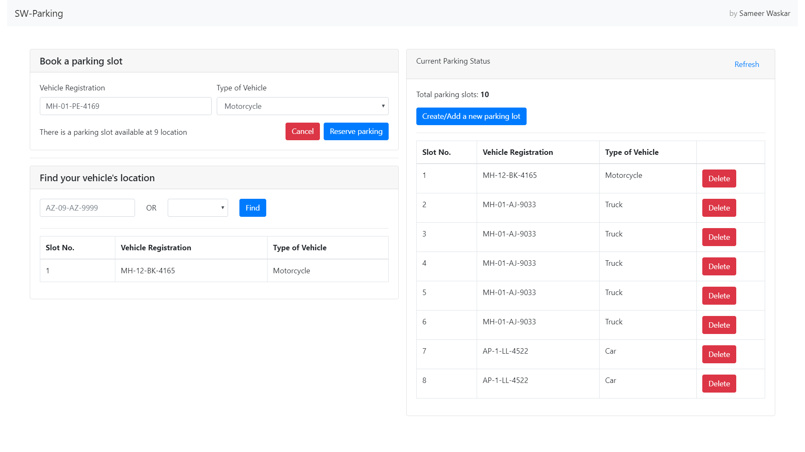

# ng-parking-lot

A Multi Storey parking lot system's front end engineered using Angular, Bootstrap, HTML, Less.

Build with:
 - [Angular CLI](https://github.com/angular/angular-cli) version 8.3.14.
 - [Bootstrap 4](https://getbootstrap.com)
 - Node.js (backend)

## Features
1. Create or Add spaces to a parking lot.
2. Find an empty space in a parking lot for your vehicle.
3. Park your vehicle at the first available space in the parking lot.
4. The vehicle slot and type can also be fetched using the registration number and vice-versa.
5. Display the count of each kind of vehicle present at the lot at any point of time.
6. Remove your vehicle from the parked spot freeing that space.

## Development server

Run `ng serve` for a dev server. Navigate to `http://localhost:4200/`. The app will automatically reload if you change any of the source files.

## Build

Run `ng build` to build the project. The build artifacts will be stored in the `dist/` directory. Use the `--prod` flag for a production build.

## Running unit tests

Run `ng test` to execute the unit tests via [Karma](https://karma-runner.github.io).

## Running end-to-end tests

Run `ng e2e` to execute the end-to-end tests via [Protractor](http://www.protractortest.org/).

## Further help

To get more help on the Angular CLI use `ng help` or go check out the [Angular CLI README](https://github.com/angular/angular-cli/blob/master/README.md).
